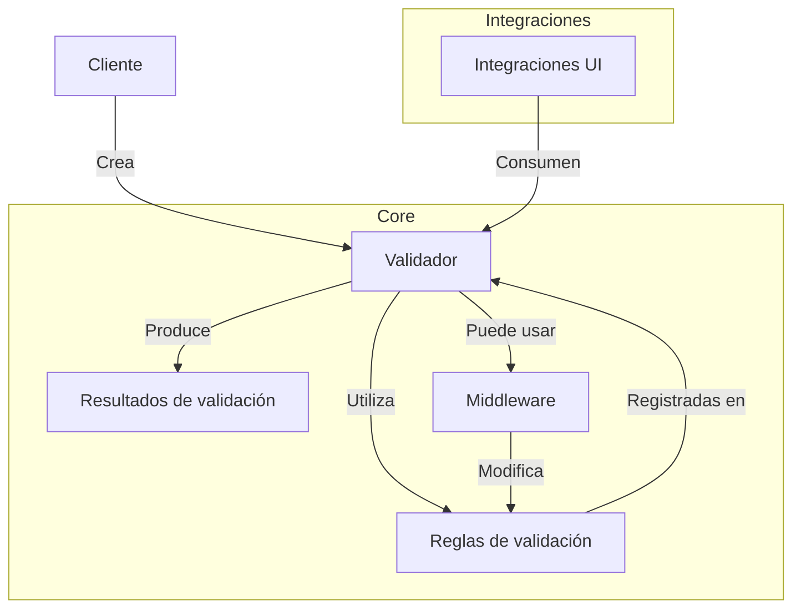
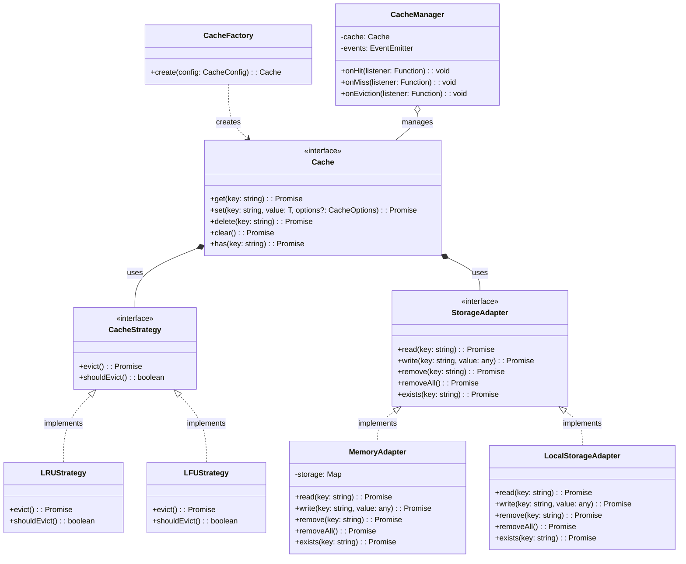

# Definición y diseño

El desarrollo asistido por IA está transformando la forma en que definimos y diseñamos bibliotecas de software. Los Modelos de Lenguaje Grande (LLMs) como GPT-4 y Claude pueden ayudar significativamente en las fases iniciales del desarrollo de una biblioteca TypeScript, desde la definición de requisitos hasta la arquitectura y diseño de la API. Este documento explora cómo aprovechar estas herramientas para mejorar y acelerar el proceso de diseño de bibliotecas.

## Definición de requisitos

La fase de definición de requisitos es crucial para el éxito de cualquier biblioteca. Los LLMs pueden ayudar a clarificar, expandir y refinar tus ideas iniciales.

### Explorando ideas con IA

Comenzar con una idea vaga y refinarla mediante conversaciones con un LLM puede ser extremadamente productivo:

```
Prompt: Estoy pensando en crear una biblioteca TypeScript para manejar validaciones de formularios en aplicaciones web. ¿Qué características clave debería incluir para diferenciarla de otras bibliotecas existentes?
```

A partir de la respuesta del LLM, puedes hacer preguntas de seguimiento para profundizar en aspectos específicos:

```
Prompt: Mencionaste validaciones asíncronas. ¿Cuáles serían los casos de uso más comunes para este tipo de validaciones y cómo debería estructurar la API para hacerla intuitiva?
```

### Análisis de competidores

Los LLMs pueden ayudarte a analizar bibliotecas existentes y encontrar oportunidades de mejora:

```
Prompt: ¿Cuáles son las principales bibliotecas de validación de formularios para TypeScript? ¿Puedes analizar sus fortalezas y debilidades?
```

Seguido de:

```
Prompt: Basándote en las debilidades que identificaste, ¿qué características específicas podría implementar en mi biblioteca para abordar esos problemas?
```

### Definición de público objetivo

Para diseñar una biblioteca efectiva, es importante entender a quién está dirigida:

```
Prompt: Mi biblioteca de validación de formularios está destinada principalmente a desarrolladores de React y Vue. ¿Qué consideraciones específicas debería tener en cuenta para cada framework? ¿Cómo podría diseñar la API para que sea natural de usar en ambos entornos?
```

### Especificación de casos de uso

Pedir al LLM que genere casos de uso detallados puede ayudar a refinar los requisitos:

```
Prompt: ¿Puedes generar 5 casos de uso específicos para mi biblioteca de validación? Incluye tanto escenarios simples como complejos.
```

### Documento de requisitos

Una vez que has explorado suficientemente, puedes solicitar al LLM que genere un documento de requisitos estructurado:

```
Prompt: Con base en nuestra conversación, ¿puedes crear un documento de requisitos estructurado para mi biblioteca de validación? Incluye requisitos funcionales, no funcionales, y casos de uso principales.
```

## Arquitectura de la librería

Una vez definidos los requisitos, los LLMs pueden ayudar a diseñar una arquitectura adecuada para tu biblioteca.

### Diseño de alto nivel

Comienza solicitando un diseño de alto nivel basado en los requisitos:

```
Prompt: Basándote en los requisitos que discutimos para la biblioteca de validación, ¿puedes proponer una arquitectura de alto nivel? Considera modularidad, extensibilidad y facilidad de uso.
```

### Patrones de diseño recomendados

Los LLMs son excelentes para recomendar patrones de diseño apropiados:

```
Prompt: ¿Qué patrones de diseño serían más adecuados para implementar una biblioteca de validación extensible? Explica por qué recomendarías cada uno y cómo implementarlos en TypeScript.
```

### Estructura de archivos

Una estructura de archivos bien organizada es esencial para la mantenibilidad:

```
Prompt: ¿Puedes sugerir una estructura de archivos y directorios para mi biblioteca de validación? Debe seguir buenas prácticas para proyectos TypeScript y facilitar futuras contribuciones.
```

Ejemplo de respuesta:

```
src/
  ├── core/                 # Funcionalidad central
  │   ├── validator.ts      # Clase o funciones principales de validación
  │   ├── rules/            # Reglas de validación predefinidas
  │   │   ├── string.ts     # Validaciones para strings
  │   │   ├── number.ts     # Validaciones para números
  │   │   └── ...
  │   └── errors.ts         # Definiciones de errores
  ├── integrations/         # Integraciones con frameworks
  │   ├── react/            # Componentes y hooks para React
  │   └── vue/              # Componentes y composables para Vue
  ├── utils/                # Utilidades generales
  ├── types/                # Definiciones de tipos TypeScript
  └── index.ts              # Punto de entrada principal
```

### Diagramas de arquitectura

Los LLMs pueden generar descripciones detalladas de diagramas que luego puedes visualizar con herramientas como Mermaid:

```
Prompt: ¿Puedes crear un diagrama de arquitectura en Mermaid para mostrar cómo interactúan los componentes principales de la biblioteca de validación?
```

Ejemplo de respuesta:



### Decisiones técnicas

Los LLMs pueden ayudar a evaluar opciones técnicas y tomar decisiones informadas:

```
Prompt: Estoy considerando usar cadenas de validación fluidas versus un enfoque basado en esquemas. ¿Cuáles son las ventajas y desventajas de cada enfoque para una biblioteca de validación? ¿Qué recomendarías y por qué?
```

## Diseño de la API

Una API bien diseñada es crucial para la usabilidad de tu biblioteca. Los LLMs pueden ayudar a diseñar interfaces claras, consistentes e intuitivas.

### Principios de diseño de API

Comienza estableciendo principios sólidos:

```
Prompt: ¿Cuáles son los principios clave de diseño de API que debería seguir para mi biblioteca de validación TypeScript? Proporciona ejemplos de cómo aplicar cada principio.
```

### Bocetos de API

Solicita bocetos de cómo podrían verse las interfaces principales:

```
Prompt: ¿Puedes crear un boceto de cómo se vería la API principal para una biblioteca de validación? Incluye ejemplos de código para mostrar su uso desde la perspectiva del usuario.
```

Ejemplo de respuesta:

```typescript
// Enfoque basado en esquemas
const userSchema = v.object({
  name: v.string().min(2).max(50).required(),
  email: v.string().email().required(),
  age: v.number().positive().integer().optional(),
  website: v.string().url().nullable(),
});

// Validar datos
const result = userSchema.validate({
  name: "John Doe",
  email: "john@example.com",
  age: 30,
});

// Alternativa: Enfoque de cadena fluida
const validator = new Validator();
const result = validator
  .check("name")
  .isString()
  .minLength(2)
  .maxLength(50)
  .required()
  .check("email")
  .isEmail()
  .required()
  .check("age")
  .isNumber()
  .isPositive()
  .isInteger()
  .optional()
  .check("website")
  .isUrl()
  .nullable()
  .validate({
    name: "John Doe",
    email: "john@example.com",
    age: 30,
  });
```

### Experiencia de desarrollador

Para mejorar la experiencia de desarrollo, solicita sugerencias específicas:

```
Prompt: ¿Cómo puedo mejorar la experiencia de desarrollo con TypeScript para los usuarios de mi biblioteca? Específicamente, ¿cómo asegurar que obtengan autocompletado útil y mensajes de error claros?
```

### Compatibilidad con TypeScript

El tipado es crucial para bibliotecas modernas:

```
Prompt: ¿Puedes mostrar ejemplos de cómo implementar inferencia de tipos avanzada en TypeScript para mi biblioteca de validación? Quiero que los usuarios obtengan tipos precisos para sus datos validados.
```

Ejemplo de respuesta:

```typescript
// Definición con inferencia de tipos
const userSchema = v.object({
  name: v.string(),
  email: v.string().email(),
  profile: v.object({
    age: v.number(),
    interests: v.array(v.string()),
  }),
});

// TypeScript infiere el tipo correcto
type User = InferType<typeof userSchema>;
// equivalente a:
// type User = {
//   name: string;
//   email: string;
//   profile: {
//     age: number;
//     interests: string[];
//   }
// }

// Uso con inferencia de tipos
function processUser(user: User) {
  // TypeScript proporciona autocompletado y verificación de tipos
  const { name, profile } = user;
  const { interests } = profile;
}
```

### Manejo de errores

Un manejo de errores bien diseñado es crucial para una buena experiencia de usuario:

```
Prompt: ¿Cuál sería la mejor estrategia para manejar y reportar errores en mi biblioteca de validación? Quiero proporcionar mensajes de error claros y útiles, con soporte para internacionalización.
```

### Versiones futuras de la API

Planificar para el futuro es importante para evitar cambios que rompan la compatibilidad:

```
Prompt: ¿Cómo debería diseñar mi API para permitir extensiones y mejoras futuras sin cambios que rompan la compatibilidad? ¿Qué prácticas debo seguir para garantizar la estabilidad de la API?
```

## Prototipado rápido

Los LLMs pueden acelerar el prototipado generando implementaciones iniciales que luego puedes refinar.

### Implementación inicial

Solicita una implementación básica para empezar:

```
Prompt: ¿Puedes proporcionar una implementación inicial para el núcleo de mi biblioteca de validación? Basada en el enfoque de esquemas que discutimos anteriormente.
```

### Refinamiento iterativo

Una vez que tienes una implementación básica, refínala iterativamente:

```
Prompt: Revisando el código anterior, veo que necesito más flexibilidad en el manejo de validaciones asíncronas. ¿Puedes modificar la implementación para soportar validaciones asíncronas de manera elegante?
```

### Prueba de concepto

Para verificar si la API es usable en casos reales:

```
Prompt: ¿Puedes mostrar cómo se usaría la biblioteca en un caso real? Por ejemplo, valida un formulario de registro de usuario con campos personalizados y validaciones condicionales.
```

## Ejemplos prácticos

Los siguientes ejemplos muestran un diálogo práctico con un LLM para diseñar una biblioteca, desde la idea inicial hasta un diseño detallado.

### Ejemplo 1: Definición de una biblioteca de transformación de datos

**Prompt inicial:**

```
Estoy considerando crear una biblioteca TypeScript para transformar datos entre diferentes formatos, especialmente para manipular datos JSON. ¿Qué capacidades clave debería tener?
```

**Respuesta del LLM (extracto):**

Una biblioteca de transformación de datos en TypeScript debería considerar:

1. **Transformaciones declarativas**: Permitir definir transformaciones de forma declarativa.
2. **Tipado fuerte**: Aprovechar TypeScript para garantizar transformaciones tipo-seguras.
3. **Rendimiento**: Optimizar para conjuntos de datos grandes.
4. **Composición**: Permitir componer transformaciones simples en complejas.
5. **Bidireccionalidad**: Soportar transformaciones reversibles.

**Prompt de seguimiento:**

```
Me gusta la idea de transformaciones declarativas con tipado fuerte. ¿Cómo podría verse una API para esto? ¿Podrías proporcionar un ejemplo de cómo un desarrollador definiría transformaciones entre dos estructuras JSON diferentes?
```

**Respuesta del LLM (extracto con código):**

```typescript
// Definir los tipos de origen y destino
interface SourceUser {
  firstName: string;
  lastName: string;
  email: string;
  birthDate: string; // formato ISO
  address: {
    street: string;
    city: string;
    country: string;
    postalCode: string;
  };
}

interface DestUser {
  fullName: string;
  contactInfo: {
    email: string;
    address: string;
  };
  age: number;
  region: string;
}

// Definir la transformación
const userTransformer = transform<SourceUser, DestUser>({
  fullName: (src) => `${src.firstName} ${src.lastName}`,
  contactInfo: {
    email: (src) => src.email,
    address: (src) => `${src.address.street}, ${src.address.city}, ${src.address.country}`,
  },
  age: (src) => calculateAge(src.birthDate),
  region: (src) => getRegionFromCountry(src.address.country),
});

// Uso
const sourceUser: SourceUser = {
  firstName: "John",
  lastName: "Doe",
  email: "john.doe@example.com",
  birthDate: "1990-01-01",
  address: {
    street: "123 Main St",
    city: "Boston",
    country: "USA",
    postalCode: "02108",
  },
};

const destUser = userTransformer.transform(sourceUser);
```

**Iteraciones adicionales**

A través de más intercambios, podrías refinar:

1. La sintaxis exacta de la API
2. Manejo de casos especiales (campos opcionales, arrays, etc.)
3. Implementación de funciones auxiliares
4. Estrategias de rendimiento y optimización

### Ejemplo 2: Diseño de arquitectura para biblioteca de caché

**Prompt inicial:**

```
Necesito diseñar una biblioteca de caché en TypeScript que sea flexible y extensible. ¿Qué patrones arquitectónicos recomendarías?
```

**Respuesta del LLM (extracto):**

Para una biblioteca de caché en TypeScript, recomendaría:

1. **Patrón Strategy**: Para diferentes algoritmos de caché (LRU, LFU, etc.)
2. **Patrón Factory**: Para crear instancias de caché con diferentes configuraciones
3. **Patrón Adapter**: Para integrarse con diferentes medios de almacenamiento
4. **Patrón Observer**: Para notificaciones de eventos de caché (hit, miss, eviction)

**Prompt de seguimiento:**

```
Me gusta esa estructura. ¿Puedes crear un diagrama Mermaid mostrando cómo se relacionarían estos componentes en una arquitectura coherente?
```

**Respuesta del LLM (diagrama Mermaid):**



**Prompt de seguimiento:**

```
Ahora, ¿podrías mostrarme un boceto del código para las interfaces y clases principales? Me interesa especialmente ver cómo implementarías la interfaz Cache y el patrón Strategy para los algoritmos de evicción.
```

**Respuesta del LLM (extracto con código):**

```typescript
// Core interfaces
export interface CacheOptions {
  ttl?: number; // Time to live in milliseconds
  tags?: string[]; // For grouped invalidation
}

export interface CacheConfig {
  maxSize?: number;
  defaultTTL?: number;
  strategy?: "lru" | "lfu" | "fifo";
  storage?: "memory" | "localStorage" | StorageAdapter;
}

export interface Cache<T = any> {
  get(key: string): Promise<T | null>;
  set(key: string, value: T, options?: CacheOptions): Promise<void>;
  delete(key: string): Promise<boolean>;
  clear(): Promise<void>;
  has(key: string): Promise<boolean>;
  invalidateByTag(tag: string): Promise<void>;
}

// Strategy pattern for eviction algorithms
export interface CacheStrategy {
  record(key: string): void;
  evict(): Promise<string | null>; // Returns key to evict, or null
  shouldEvict(currentSize: number): boolean;
}

// Implementation of LRU strategy
export class LRUStrategy implements CacheStrategy {
  private readonly usage: Map<string, number> = new Map();
  private timestamp = 0;

  constructor(private readonly maxSize: number) {}

  record(key: string): void {
    this.usage.set(key, ++this.timestamp);
  }

  async evict(): Promise<string | null> {
    if (this.usage.size === 0) return null;

    let lruKey: string | null = null;
    let lruTimestamp = Infinity;

    for (const [key, timestamp] of this.usage.entries()) {
      if (timestamp < lruTimestamp) {
        lruTimestamp = timestamp;
        lruKey = key;
      }
    }

    if (lruKey) {
      this.usage.delete(lruKey);
    }

    return lruKey;
  }

  shouldEvict(currentSize: number): boolean {
    return currentSize >= this.maxSize;
  }
}

// Main cache implementation
export class InMemoryCache<T = any> implements Cache<T> {
  private readonly storage: Map<string, { value: T; expires: number; tags: string[] }> = new Map();
  private readonly strategy: CacheStrategy;

  constructor(private readonly config: CacheConfig = {}) {
    // Initialize with the specified strategy or default to LRU
    switch (config.strategy) {
      case "lru":
      default:
        this.strategy = new LRUStrategy(config.maxSize || 1000);
        break;
      // Other strategies would be initialized here
    }
  }

  // Implementation of Cache methods...
}
```

## Herramientas recomendadas

Además de los LLMs, existen otras herramientas que pueden complementar el proceso de diseño:

### Diagramas y visualización

- **[Mermaid.js](https://mermaid-js.github.io/)**: Para crear diagramas a partir de descripciones de texto.
- **[Excalidraw](https://excalidraw.com/)**: Para bocetos y diagramas de aspecto manual.
- **[Whimsical](https://whimsical.com/)**: Para diagramas de flujo y wireframes.

### Documentación y colaboración

- **[VitePress](https://vitepress.dev/)**: Para documentación estática con Vue.
- **[Miro](https://miro.com/)**: Para pizarras colaborativas.
- **[Notion](https://www.notion.so/)**: Para documentación y gestión de proyectos.

### Prototipado

- **[CodeSandbox](https://codesandbox.io/)**: Para prototipos rápidos en el navegador.
- **[StackBlitz](https://stackblitz.com/)**: Entorno de desarrollo web para prototipos.

## Buenas prácticas

### Equilibrio entre IA y criterio humano

Los LLMs son herramientas poderosas, pero el criterio humano sigue siendo esencial:

1. **Verifica las sugerencias**: No aceptes las sugerencias de la IA sin evaluarlas críticamente.
2. **Itera gradualmente**: Construye tu diseño paso a paso, no de una sola vez.
3. **Considera diferentes perspectivas**: Pide a la IA que presente enfoques alternativos.

### Documentación del proceso de diseño

Documenta el proceso de diseño para futuras referencias:

1. **Guarda conversaciones clave**: Mantén un registro de las conversaciones más significativas con la IA.
2. **Documenta decisiones**: Explica por qué tomaste ciertas decisiones de diseño.
3. **Mantenla actualizada**: Actualiza la documentación cuando el diseño evolucione.

### Validación con usuarios reales

Aún con asistencia de IA, la validación con usuarios reales es crucial:

1. **Comparte prototipos temprano**: Obtén feedback de otros desarrolladores.
2. **Prueba escenarios reales**: Verifica si tu diseño funciona en casos de uso reales.
3. **Ajusta basado en feedback**: Refina el diseño según las opiniones de los usuarios.

## Limitaciones y consideraciones

### Conocimiento limitado de los LLMs

Los LLMs tienen limitaciones en su conocimiento:

1. **Conocimiento desactualizado**: Pueden no estar al día con las últimas bibliotecas o prácticas.
2. **Entendimiento parcial**: Su comprensión de conceptos complejos puede ser superficial.
3. **No tienen experiencia real**: Les falta la intuición que viene de la experiencia práctica.

### Sesgos y patrones comunes

Los LLMs pueden favorecer patrones de diseño populares:

1. **Soluciones genéricas**: Pueden proponer soluciones genéricas en lugar de especializadas.
2. **Patrones populares**: Tienden a sugerir patrones ampliamente conocidos.
3. **Over-engineering**: Pueden proponer soluciones innecesariamente complejas.

## Conclusión

El diseño asistido por IA ofrece un enfoque poderoso para definir y arquitectar bibliotecas TypeScript:

1. **Eficiencia**: Acelera significativamente el proceso de diseño.
2. **Exploración**: Permite explorar rápidamente múltiples enfoques.
3. **Perspectiva**: Ofrece perspectivas y consideraciones que podrías pasar por alto.
4. **Educación**: Proporciona explicaciones detalladas que mejoran tu comprensión.

Sin embargo, el juicio humano sigue siendo indispensable para evaluar críticamente las sugerencias, considerar factores específicos del contexto y tomar decisiones finales de diseño.

La combinación de la creatividad humana con las capacidades analíticas de la IA representa un nuevo paradigma en el diseño de software, permitiendo crear APIs más intuitivas, arquitecturas más robustas y, en última instancia, mejores bibliotecas para la comunidad de desarrolladores.

## Siguientes pasos

Una vez que hayas definido y diseñado tu biblioteca, el siguiente paso natural es la implementación del código. Consulta [Codificación con LLM](/es/guide/ai-assisted/coding.md) para aprender cómo la IA puede ayudarte en el proceso de desarrollo.
